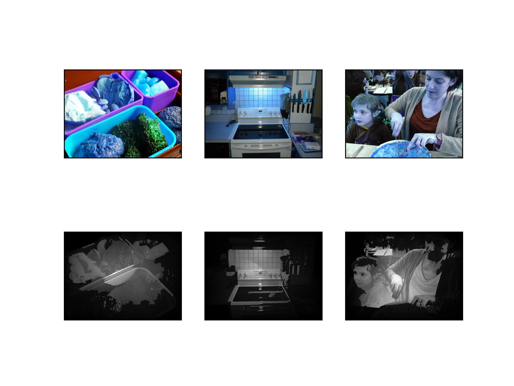

> 2022 Spring HUSTAIA

# 显著性检测经典算法实现

- 数据集：

  - 官网网址：http://salicon.net/challenge-2017/

  - 或百度网盘：https://pan.baidu.com/s/1_Eg7QtE6p4mxH4xnXEwoKA ；提取码：q7z1 

  - images:
    - train: 10000 rgb pic(jpg)
    - val: 5000 rgb pic
    - test: 5000 rgb pic
  - maps:
    - 跟images文件中的train，val对应的显著性图（png格式）

- 要求
  1. 编程实现ITTI显著性检测算法，可在数据集中选择10张图像进行实验。
  2. 编程实现MDC显著性检测算法，可在数据集中选择10张图像进行实验。
  3. 编程实现一个基于深度学习的显著性检测算法（[A Deep Multi-Level Network for Saliency Prediction 2017 Marcella.et.al](https://arxiv.org/pdf/1609.01064.pdf)）。

- 其他要点
  - 不要求复现指标，但希望有合理的可视化结果。
  - 可以考虑只使用数据集的一部分（如只用500张来训练）。
  - 为降低内存或显存消耗，可考虑降低输入图片尺寸（如240×240）；可适当更改网络结构（如降低特征图通道数）。

## 结果
### itti
第二行为模型输出

### MDC
未实现Saliency smoothing，未进行形态学滤波，第二行为模型输出

### mlnet
未调参，未修改，训练19980个batch，第二行为ground truth，第三行为模型输出

